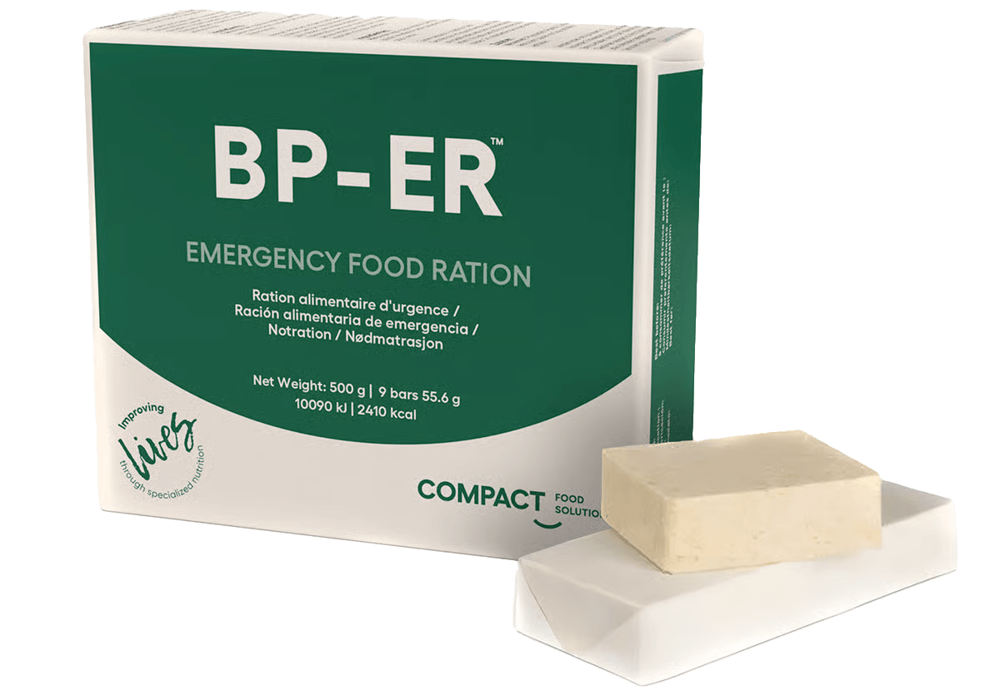

## Selv med et innholdsrikt beredskapslager med forskjellig mat kan det være greit å ha noe som raskt kan gi energi og næring.

**Et alternativ du kan bruke er BP-ER Emergeny Food Ration.**

Den kan spises rett fra pakken, uten noen form for tilberedning eller varmebehandling. Tablettene kan eventuelt smuldres i vann hvis du ikke vil spise det tørt. Når man spiser det tørt er det viktig å drikke nok vann.

<Admonition variant="tip">
  Hvis du ikke har mulighet til å skaffe deg et tilstrekkelig matlager er BP-ER et veldig fint tilskudd som enkelt sikrer deg nok næring for flere dager.
</Admonition>

En pakke dekker dagsbehovet for en voksen person. Den kan spises av barn som er 6 måneder og eldre, men da i mindre porsjoner og blandet i vann som grøt for de yngste.

En eske veier 500 gram og inneholder 18 tabletter som dekker næringsbehovet for en voksen person i 24 timer. Pakkene har 7 års holdbarhet fra produksjonsdato.

<Admonition variant="info">
  **Det er flere grunner til at denne type nødmat kan være greit å ha i tillegg til maten i beredskapslageret:**

  * Hvis du må evakuere på kort varsel er det veldig enkelt å få med seg noen pakker.
  * På hytta kan de være et godt supplement siden du mest sannsynlig ikke har et stort matlager der.
  * Ta med noen pakker i bilen på lengre kjøreturer i tilfelle motorstopp, stengte veier, kolonnekjøring og lignende.
  * Passer fint å ha med i 72-timerssekk, nødveske etc. siden de kan spises rett fra pakken
  * Gi til naboer, venner og andre i en krisesituasjon hvis de selv ikke har beredskapslager av mat
</Admonition>

## Ut på tur

Når de nærmer seg utløpsdato kan de fint brukes på tur som en enkel måte å få i seg næring på uten noe oppvarming. Går du lengre turer er det en fin og enkel måte å tilføre kalorier og næring på.

## Ingredienser

Nødmaten er laget av hvetemel, vegetalsk olje (palme), sukker, glukosesirup, melk og proteiner. Den kan inneholde spor av soya.

## Kan kjøpes fra norske nettbutikker

Har så langt funnet to steder du kan kjøpe den her i Norge:

* [Røde Kors nettbutikk](https://www.rodekorsforstehjelp.no/produkter/bp-er-nodrasjonproviant-for-beredskap-10099/)
* [Alf Lea dykke- og sikkerhetsutstyr (nettbutikk)](https://www.dykk.no/bp-er-emergency-rations-500g-pack)

