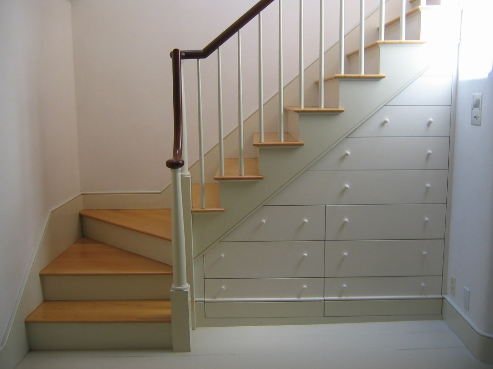

## **Lagringsplass du kanskje ikke visste du hadde**

* **Under senga:** Her kan du lagre lave bokser med forskjellig innhold, vannkanner og annet. For å øke plassen kan du heve senga noen centimeter med klosser.
* **Under sofa og benker:** Sjekk om det er ekstra plass ledig som kan brukes. Spesielt benker kan være aktuelle. Her kan du plassere kasser eller esker med utstyr som samtidig pynter opp.
* **Pyntebokser og puffer:** Mange av disse har lokk som kan tas av og hulrom som kan benyttes til lagringsplass.
* **På toppen av skap og garderobe:** Hvis ikke klesskapet går helt opp til taket er det et ypperlig sted for lagring. Større ting kan settes rett på skapet, mens mindre ting kan samles i bokser av plast, papp eller stoff.
* **Under eller i trappa:** Trapperommet er ofte et "dødt" areal som kan brukes til lagring. Selve trapperommet kan kanskje brukes som det er, eventuelt kan du montere en gardin foran eller bygge det inn så det ser "renere" ut. Er du ekstra kreativ er det i noen trapper mulig å sette inn skuffer i trinnene.

  \
  Bilde: [kikisdad, flickr](https://www.flickr.com/photos/kikisdad/25543650/in/photostream/)\

* **Over og rundt dører:** Ofte er det plass til noen enkle hyller over og ved siden av dører på rom hvor det kan passe. En forholdsvis liten og smal hylle kan gi plass til esker med mindre beredskapsutstyr. Sørg for at hyllene er godt festet, siden de henger over hodehøyde.

## **Smart bruk av eksisterende lagringsplass**

* **Bygg i høyden:** De fleste skap og boder har luft mellom hyllene. Ved å sette inn noen ekstra hyller kan du øke kapasiteten ganske mye. Spesielt i boden kan du montere hyller helt opp mot taket. Der kan du også sette stablekasser oppå hverandre fra gulv til tak for å benytte plassen best mulig.
* **Bruk innsiden av skapdørene:** Mange skap har litt ekstra plass mellom døra og innholdet. Der kan du sette opp kroker, trådkurver eller smale hyller som kan brukes til å lagre mindre ting.
* **Øverste hylle og bunnen av skapet:** Øverste hylle i klesskapet passer for lette beredskapsvarer. På gulvet under der klærne henger kan flate bokser plasseres, eller noen kanner/flasker med vann.
* **Ekstra plass i klesskapet:** Har du litt ekstra plass i noen av hyllene i klesskapet, kan du samle klærne i front og bruke den bakre delen til beredskapsting.
* **Ekstra plass i matskapet:** Hyllene i matskapet kan kombinere daglig bruk og beredskapslagring. Plasser flere matvarer av samme type bak hverandre. Bruk den som står foran, og når du kjøper inn nytt av matvaren plasserer du den bakerst. Samme prinsipp bør brukes på lagret vann og batterier – bytt ut jevnlig og sjekk utløpsdatoer, så er beredskapslageret alltid  klart til bruk.

## **Tenk på fukt, temperatur og tilgjengelighet**

Ikke alle steder egner seg for alle typer utstyr. Bod og loft kan ha store temperatursvingninger og fukt, noe som kan skade batterier, medisiner og elektronikk over tid. Papp fungerer dårlig i fuktige rom, så velg heller plastbokser her.

Viktig utstyr som lommelykt/hodelykt og førstehjelpsutstyr bør være lett tilgjengelig, ikke gjemt bakerst eller høyt oppe. Når strømmen er borte og det er mørkt må du ha tilgang til disse raskt og enkelt.

## **Har du liten plass så tenk kompakt**

I tillegg til å kreativt utnytte plassen du har til forskjellig lagring, kan du også tenke litt over størrelsen på utstyr du skaffer til beredskapslageret. I stedet for et stort gasskokeapparat kan du bruke et mindre beregnet for turbruk. I stedet for en stor lommelykt kan du bruke en hodelykt som tar mindre plass.

## **Merk og hold oversikt**

Når utstyret er spredt på forskjellige steder som under senga, i boden, over dører og i skap, blir det ekstra viktig å ha kontroll. Merk boksene tydelig med innhold, og gjerne dato hvis det er noe som bør skiftes ut jevnlig. Lag en enkel liste over hva du har og hvor det er lagret, så finner du raskt fram det du trenger når det gjelder.

## **Viktig å tenke på:**

* Blokker aldri rømningsveier med lagret utstyr
* Sikre tunge gjenstander som står høyt oppe
* Unngå fukt- og temperaturutsatte steder for batterier, medisiner og elektronikk
* Roter på mat, vann og batterier
* Merk boksene og hold oversikt
* Ha det viktigste utstyret lett tilgjengelig

**Ved å kombinere kreativ bruk av plassen din og tenke kompakt rundt de tingene du kjøper til lageret ditt, er du på god vei til et fornuftig og effektivt beredskapslager.**
